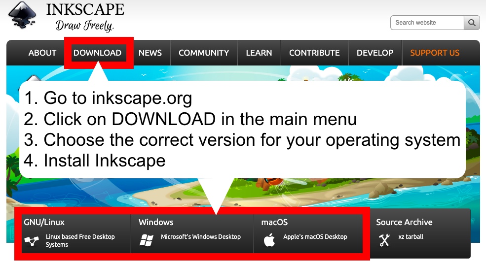
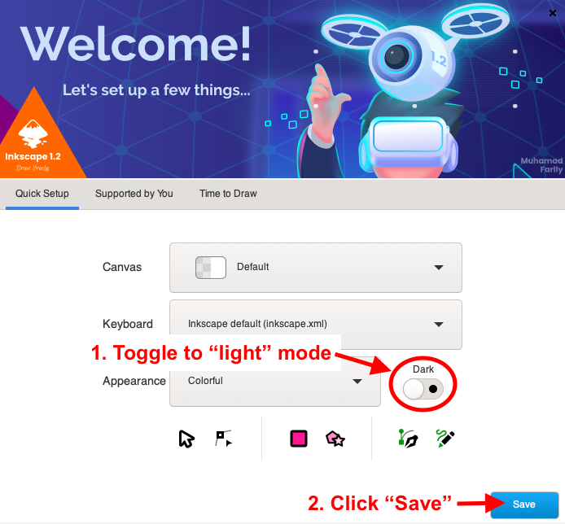
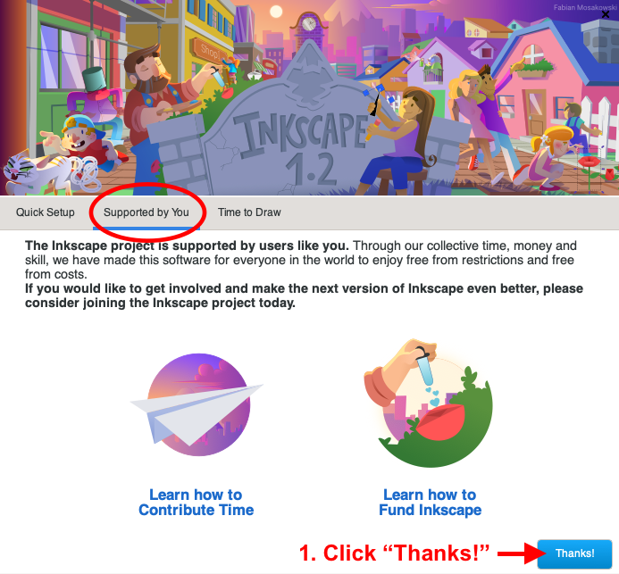
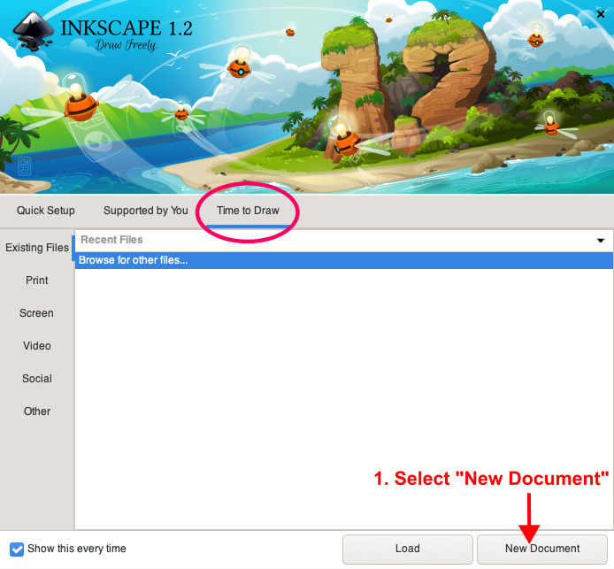
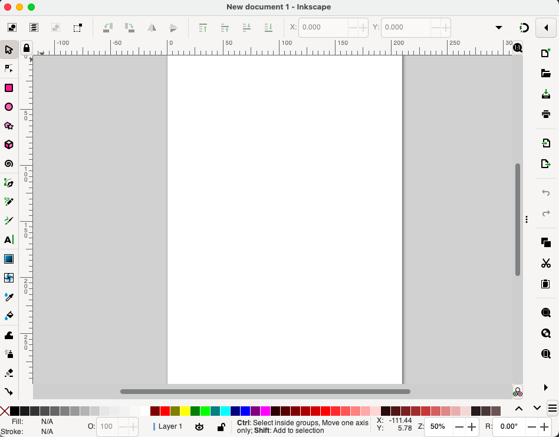

# Installing _Inkscape_ and Introducing its Interface

If you have not already sone so, please complete the [the pre-workshop section](#) before doing this tutorial. 

Now it is time to install _Inkscape_ on your computer. **Note that this tutorial is for _Inkscape_ 1.2.** 

Please ask for assistance if you run into any snags. Here we go! 

## 1. Download and install _Inkscape_

### Background
- When you install _Inkscape_, you will be walked through a few choices to make prior to opening the program for the first time. 
- We will click through the suggested options and make only one change, which is setting the theme to "Light" mode, mostly because it will be easier to see the tutorial images. 
- The images in this tutorial might look slightly different than what you see in your version of _Inkscape_, depending on your system (Windows, macOS, or Linux). 
- _Inkscape_ takes up roughy 600MB of space on your hard drive. 

### Practice
**1.1.** **Go to [inkscape.org (↪)](https://inkscape.org/release/inkscape-1.2.1/) and install the correct version** of _Inkscape_ for your operating system (macOs, Windows, or Linux). 

**1.2.** In the "Quick Setup," or "Welcome," window, toggle to **Light** mode and click **Save**. 

**1.3.** In the "Supported by You" window, click **Thanks!**. 

**1.4.** In the "Time to Draw" window, click **New Document**. 

You should now see a blank page in _Inkscape_'s main interface, which should look something like this example (macOS version):

**1.5.** Familiarize yourself with _Inkscape_'s interface by taking a few minutes to look at the following picture:

Image source: [The Inkscape Beginner's Guide (↪)](https://inkscape-manuals.readthedocs.io/en/latest/interface.html).  

**All done ✓** You are now ready to move on to your next tutorial. 
 
[NEXT STEP: _Inkscape_'s Selector Tool]([???.html](https://github.com/kimshortreed/DSCsandbox/blob/main/activity-2.md)){: .btn .btn-blue }
