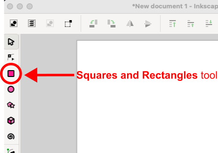
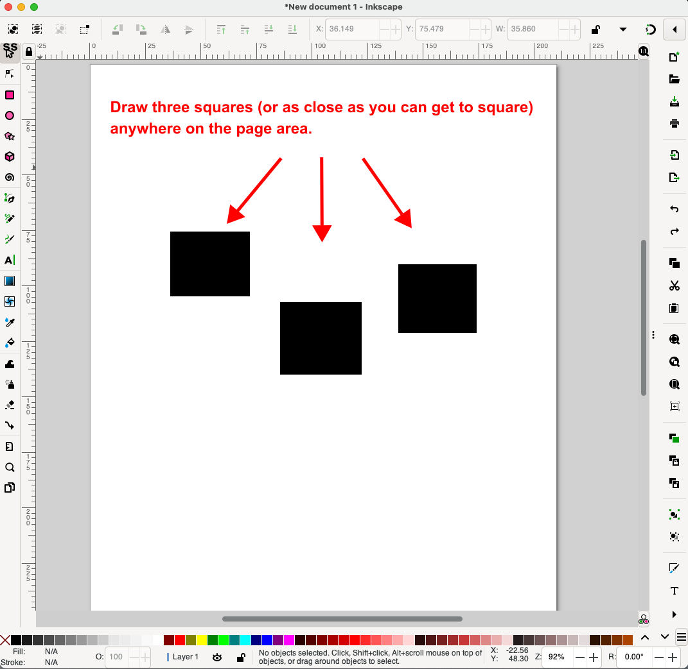

# Using _Inkscape_'s Selector Tool

We are starting with the **Selector** tool because you will be using this for almost everything you make in _Inkscape_, especially moving objects around on the **page area**.

The **Selector** tool is designed to help you do most of the things you'd ever want to do with an object: **move, scale, skew,** or **rotate** it.  

Take your time with this tutorial because the **Selector** tool can sometimes seem confusing until you get used to it. 

Let's get practicing! 

## 1. Draw three boxes on the _Inkscape_ page area

### Background
- We need to have some objects to play with in order to get used to using the **Selector** tool, so we are are going to draw three squares on the **page area** and manipulate them using the **Selector** tool. 
- The process of making our squares will also introduce you to _Inkscape_'s **Toolbox** and to some optional but handy keyboard shortcuts.
- Please do not worry about the exact sizes, shapes, or colours of the squares at this point, as we just need to have something to start with. 

### Practice
#### **1.1.** Click on the Squares and Rectangles tool in the toolbox. 

>#### Tips
- The **Squares and Rectangles** tool is located third from the top of the toolbox.

- **Optional keyboard shortcut**: hit **R** on your keyboard.
- You will know you have activated the **Squares and Rectangles** tool because the cursor will change to a square and a + sign. **Note** that the + sign is the now the centre of the cursor:.

#### **1.2.** **Draw three squares (or as close as you can get to square)**, spaced apart from each other, on the **page area**. 

>#### Tips
- Left click and drag in any direction to make a square to your desired size. 
- The proportions of the squares (or rectangles) do not matter at this point, as we just need some objects to play with. 
- Release left click when you are happy with your square' size and repeat the process until you have drawn three squares. 

## 2. Practice using the **Selector** tool

### Background
- Now that we some objects to play with, it is time to get used to the **Selector** tool. 
- Note that **clicking on an object more than once will activate a different features of the Selector tool**. 
- We are going to use the **Selector** tool manipulate our boxes in the four options available when using this tool:
  - **move** literally moves objects around on the **page area**. 
  - **scale** changes the size of objects
  - **skew** slants objects, for example, skewing (also know as shearing) a square into parallelogram shape
  - **rotate** rotates objects relative to their centre point
- We will also use the **Selector** tool to select single and multiple objects in different ways. 

### Practice
#### **2.1.** Click on the Selector tool in the toolbox. 

>#### Tips
- The **Selector** tool is located at the top of the toolbox. 

- **Optional keyboard shortcut**: hit **S** on your keyboard.
- You will know that the **Selector** tool is active because the cursor will change to a pointer arrow: .

#### **2.2.** On one of the squares, click and hold move it around the page area. 

>#### Tips
- **Click** within the body any of **your squares** and move them around the **page area** anywhere you like. 
- Release the left-click hold to stop moving the square(s). 

#### **2.3.** On one of the square's _corner_ two-way arrows, click and hold, then motion your mouse to change the square's scale. 

>#### Tips
- When you click on a square you will notice that two-way-arrows appear around the outside edges of the square . 
- You can **click and hold on any one of the arrows** and then slide the square bigger and smaller.
- Notice that the **corner arrows** scale a square's size but also change its vertical and horizontal proportions. 
- The **edge arrows** (the top, right, bottom, and left arrows) also scale, but only in one plane at at time.   
- Release the mouse hold to stop scaling. 

#### **2.4.** Click on a square until the corner two-way arrows become curved. 

>#### Tips 
- Any unselected objects, like our example squares _not_ surrounded by two-way arrows, will need to be clicked on twice to make the curved two-way arrows appear. 
- Squares already surrounded by two-way arrows will only need to be clicked on once to make the curved two-way arrows appear. 
- This is to set us up to use the **skew** and **rotate** features of the **Selector** tool.

#### **2.5.** On one of the straight two-way arrows (_not_ the curved ones), click and hold, then motion your mouse to _skew_ the square.   

>#### Tips 
- Release the mouse hold to stop skewing.
- You can **skew** using any of the straight two-way arrows, but the curved arrows allow you to rotate objects, like our example square, which we will practice next. 

#### **2.6.** On one of the curved (corner) two-way arrows, click and hold, then move your mouse in circular motion to _rotate_ the square.   

>#### Tips 
- Release the mouse hold to stop rotating.
- You can **rotate** using any of the curved two-way arrows. 

We have now covered the four features of the **Selector** tool. The **Selector** tool is helpful when you want to arrange and scale objects roughly how you would like. _Inkscape_ has several ways to manipulate objects and with greater precision, which you can learn about in our other tutorials.  

**All done ✓** You are now ready to move on to your next tutorial. 
