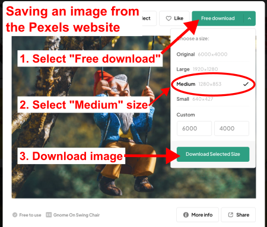
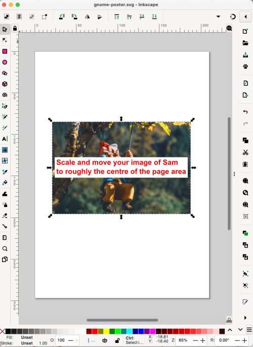
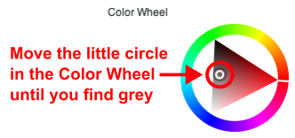
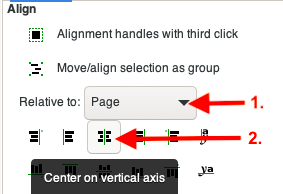

# Make a poster for a missing garden gnome

### Background 

Sam, your garden gnome, has come to life and gone walking around your neighbourhood!

You need to let your neighbours know that Sam is missing, so you plan to put some posters up on some local telephone poles. 

In the process of making this simple poster, you will get to know some very helpful _Inkscape_ tools!

Let's get started. The longer we wait the hungrier Sam will be when they get back... 

## 1. Create a new, blank document in _Inkscape_ 

### Background
- We are going to create a standard 8.5 x 11 inch (A4) poster so we want our **page area** to be the right size. 
- Lucky for us, _Inkscape_'s default size for a new file is an A4 sheet of paper.

### Practice
#### 1.1. In _Inkscape_'s main menu, select File > New.  

>##### Tips
>
>
>**Optional keyboard shortcut**: hit **Ctrl (or Command) + N** on your keyboard to create a new, blank file.

#### 1.2. Save your image file to your Desktop and name it `gnome-poster.svg`. 

>##### Tips
>
>
>- **Optional keyboard shortcut**: hit **Shift + Ctrl (or Command) + S** on your keyboard to initiate the "Save As" dialogue window.
>- SVG is the default file type in _Inkscape_.

## 2. Add a picture of a garden gnome

### Background
- We need to add a picture of Sam to our poster's **page area**. We can have some fun with this! Choose a picture of a gnome that you think best represents Sam. 

### Practice
#### 2.1. Save a gnome image from the [Pexels (↪)](https://www.pexels.com/search/gnomes/) website to your computer

>##### Tips
>- Pexels is a website that offers free photos and videos for public use. 
>- Once you've chosen an image, you can **right-click on the image** and then use the **Save Image As** dialogue to save the image to your computer. 
>- As an alternative to using the **Save Image As** method, you can save the image using Pexels's **Free download** button to the top-right of the image. This feature of the Pexels's website allows you to save the image at your preferred size. We need an image that is neither too big nor too small, so **choose a "Medium" sized (1280 x 853 pixels) image**. 
>
> 

#### 2.2. Import your gnome picture into _Inkscape_ using File > Import 

>##### Tips
>- There are two ways to import images into _Inkscape_: 
>   - Image-import **option 1**: in _Inkscape_'s **main menu** select **File > Import**.
>   - Image-import **option 2**: drag-and-drop images from your computer (from your Desktop or Downloads folder, for example) onto _Inkscape_'s **page area**.
>- In the process of importing the image—using either **File > Import** or drag-and-drop—you will encounter a **bitmap image import** dialogue window: leave all the options alone and click on the **OK** button.
 >
> 
>
>- For the curious, [here is a good explanation (↪)](http://tavmjong.free.fr/INKSCAPE/MANUAL/html/File-Import.html) of the **bitmap image import** dialogue window's options and what they do.

#### 2.3. Scale and move your image as needed and place it roughly in the centre of the page area 

>##### Tips
>- We want to the image of Sam to be large, but we also need to allow for room above and below the image, so that we have room for text.
>
>

## 3. Add title text above your image of Sam

### Background
- We are going to add a page title, or heading, and some vital information above our image of Sam. 

### Practice
#### 3.1. Use the "text objects tool" to add the following title text above your image of Sam: "Missing Garden Gnome" 

>##### Tips
>- The **text objects tool** allows you to add text anywhere on the **page area**.
>- You will know that **text objects tool** is selected when you see the pointer change to look like this: 
>
>- Once you have selected the **text objects tool**, click on the page area wherever you like and you should see a blinking cursor (the kind you would see in many word-processing programs), which indicates that you are ready to start typing. 

#### 3.2. Use the "text objects tool" to add a paragraph of information about Sam 

>##### Tips
>- Note that the **text objects tool** can be used in two ways: (1) you can click on the **page area** and start typing, or (2) you can click, hold, and drag to create a text box. We will create a text box *before* we add our text. We do this so the the text looks like a paragraph, rather than one long line of text with no carriage returns. 

##### 3.2.1. Between the title and the image of Sam, create a text box

>##### Tips 
>- Select the **text objects tool** again, or ensure that it is already selected; the cursor should look like this: 
>
> 
>
>- Text boxes can be rescaled before or after you add text. 
>
>
>
>- After you release the mouse click, your text box boundaries will turn blue and you will see a cursor in the top-left of the text box. Now, you're ready to add text.
> 
>

#### 3.2.2. Add a paragraph of text to the text box

>##### Tips
>- Remember that text boxes can be rescaled before or after you add text. 
>- Optionally, as you did for the title (see 3.1.), change the font, this time to Arial > Normal > 12 pt. 
>- To rescale the textbox, select the **text objects tool** and then click, hold, and drag the little square to the bottom-right of the text box.
>
>

- Feel free to get creative with your information about Sam. Perhaps your Sam has some distinguishing features or habits that will help your neighbours identify them. There is no right or wrong with this content! 
- You are also welcome to copy/paste the following blurb about Sam:

Sam the garden gnome went missing last Saturday afternoon. It is possible that Sam went on an undeclared vacation to Europe, but they have also been known to wander into the local park for a nap and then get a little confused when trying to get home. Sam is 23cm (~9") tall and weighs about the same as a grapefruit. Last seen wearing tan-coloured pants, pointy red hat and a blue coat. Sam is usually very friendly and has a love of precious gems, so protect your rings as you approach! Sam's favourite food is mini-marshmallows, any flavour. Please help us get Sam back safely into our garden!

**By this stage in this tutorial your missing gnome poster should look something like this:**

Nearly there! Now we need to add some of those tear-off tabs with numbers on them, so that your neighbours can call you if they left their phone at home, or if they have only a land line!

 Remember to save your file as you go (**Save file shortcut: CTRL (or Command) + S**! 

## 4. Add some tear-off tabs with contact information on them  

### Background
- This part of the tutorial gets slightly more complicated because we will need to create some dashed lines and rotated text, so that our contact information reads as vertical within each tab. 
- To simplify things, we will create just one tear-off tab and then copy/paste it multiple times to make the others. 

### Practice 
#### 4.1. In the main tool library, select the "Draw freehand lines" tool

>##### Tips
>- The cursor for this tool looks like a little pencil. 
>
>

#### 4.2. In the "page area", click once and move the mouse around in circles

>##### Tips
>- The cursor for this tool looks like a little pencil. 
>- As you move the mouse around, a red line will appear between the anchor point and the pencil. 
>- Moving away from the anchor point will make the red line longer and moving it closer will make the red line shorter. 

#### 4.3. Use the  "Draw freehand lines" tool to draw a straight, vertical line roughly halfway between the gnome picture and the bottom of the page

>##### Tips
>- You could try moving the **Draw freehand lines** pencil around until you see a vertical line, but it's difficult draw a _perfectly_ vertical line by hand. Fortunately, _Inkscape_ has a way to make perfectly straight lines...
>- Hold down **Ctrl (or Command)** as you move the mouse around _slowly_ and notice what happens: you will see the red line hold position perfectly at various points, such as exactly horizontal, or at 45°, or exactly vertical, which is what we want. 
>- Once you have a vertical line at the length and position you want, click again to create your line. 
>
>

**<mark>IMPORTANT</mark>: you may not actually see a line at this point**, and this is because we need to tell _Inkscape_ what style of line we want, which is the next step...

##### 4.3.1. In _Inkscape_'s main menu, select "Object > Fill and Stroke..."

>##### Tips
>- **Optional keyboard shortcut**: hit **Shift + Ctrl (or Command) + F** on your keyboard to open the **Object > Fill and Stroke...**.
>- Mostly, the **Fill and Stroke...** options are used for boxes, circles, and lines, or "objects" that you draw using some of _Inkscape_'s tools that draw things like, you guessed it, boxes, circles, and lines.
>- Think of "stroke" as the outer walls of a house and the "fill" as everything within the house.  
>- The "stroke" in **Fill and Stroke** controls options for the line(s) that make up the outside lines of a box or circle, for example. 
>- The "fill" in **Fill and Stroke** controls options for things within the "stroke," or the space within a box or circle, for example.

- With the **Fill and Stroke** editor open, we are ready to draw our first line. 

##### 4.3.2. In the "Fill and Stroke..." editor select the "Stroke paint" tab

>##### Tips
>- You will know that the **Stroke paint** tab is selected because the tab will be underlined in blue. 
>
>

##### 4.3.3. In the "Stroke paint" options, select "Flat color"

>##### Tips
>- "Flat" colour in means that the colour will be solid, as opposed to a gradient (a transition from one colour to another, for example) or a pattern, like dots or lines, for example. 
>
>

- You should see your vertical line appear on the **page area**, but we are going to modify it a little more... 

##### 4.3.4. In the "Stroke paint" options, change the stroke colour to dark grey

>##### Tips
>- There are a number of ways to change the colours of things in _Inkscape_, but we are going to use the **Color Wheel**. 
>- Make sure that your line is selected, using the **Select and transform objects** select tool, or the **Stroke paint** options interface may not appear.
>- To reveal the **Color Wheel**, click on the **Color Wheel** expander button/arrow:
>
>
>- You should see the **Colour Wheel** interface: 
>
>

- In the **Color Wheel** circle, move the little white circle around until you find a colour that looks grey to you. This need not be perfect! As long as the colour is not black, it should work for our project. 

- Now that we have changed the colour, we will make a dashed line...

##### 4.3.5. In the "Stroke paint" options, apply "Stroke style" options to your line

- In the **Fill and Stroke** editor, select the **Stroke style** tab and change the following settings: 
	- **Width: 2 px** (note that the default measurement is in millimetres, or mm)
	- **Dashes: Pattern 4 1** (note that the Pattern number value will not appear until you select a dashed line; note also the space between the 4 and the 1)

You should now see a dashed line in your **page area** that looks something like this: 

Next, we will add some text to our tear-off strip...

### 4.4. In the main tool library, select the "text objects tool" (as you did for the poster's title) and add some pretend contact information

> ##### Tips
> - Whatever text you add will eventually have to fit within our little tear-off tabs, so do not add too much. 
> - Choose whatever font you like, and an a font size that looks like it will work. We can always rescale it later. 

- You can make you own, or use this sample text for your Tear-off strip: Found Sam? Please email missgnomer@gnomail.com

Here is an example of what the contact text should look like at this point in our process: 

##### 4.4.1. Select the "Selector tool" and then click _once_ on your contact-information text

> ##### Tips
> - If you do this step correctly, you should see the contact-information text surrounded in a dashed-line rectangle and straight arrows, as in the following example:
>  
> 

##### 4.4.2. Click on the "Rotate clockwise" icon in the "Control tools bar"

> ##### Tips
> - Clicking on this **Rotate clockwise** tool (there are others in the **Control tool bar**) will rotate your contact text 90° clockwise. 

- Here is an example of what the contact text should look like at this point in our process: 

 Remember to save your file as you go (**Save file shortcut: CTRL (or Command) + S**! 

### 4.5. Clone the tear-off tabs 

>##### Tips
>- We will use the **Select tool** to move our vertical dashed line and vertical text into place, then we will group and then clone the one tear-off tab to create as many as we need to fill the bottom of the page.

#### 4.5.1. Use the "Select tool" to arrange the vertical dashed line and the contact information (the tear-away tab) to near the bottom left of the page area

>##### Tips
>- Use the **Select tool** to arrange the dashed line and the contact text until they look like they are spaced appropriately. There is no right or wrong with this step. Try to arrange them until they look good to you. 
>- You can also use the **Select tool** to scale either the the dashed line the contact text, in order to get them to fit together better, visually.

- Here is an example of how to arrange the dashed line and the contact text so they are spaced relatively evenly: 

#### 4.5.2. Use the "Select tool" to select and "group" the dashed line and the contact text

>##### Tips
>- _Inkscape_ has a **group** feature that allows you to turn two or more objects into one object, and back again. This is handy in cases like our dashed line and contact text: we have lined things up the way we want and groping them together will allow us to move them around as one object, so that we do not have to arrange them again.  
>- To **group** objects, click to the outside of both objects you want to (you can even click outside the **page area**), then hold the mouse click and drag a box around the objects you want to group together. 

- You will know that the objects are grouped together because each object will have a dashed-line box around it, as in the following example: 

Now the we have our objects selected, we need to make them become a single object...

#### 4.5.3. Once your objects are selected, in _Inkscape_'s main menu click Object > Group

##### Tips
>- **Optional keyboard shortcut**: hit **Ctrl (or Command) + G** on your keyboard to **group** objects. 
>- Any grouped objects, including text, can be scaled all at once using the **Selector tool** to select the object, then the arrows to drag-resize to any scale you want. 

- You objects should now be surrounded in single dashed-line box, which means that _Inkscape_ now sees your objects as a single object, as in the following example:

- Note that the dashed box now surrounds both the text and our grey, tear-off dashed line.
- Now we are ready to make copies of our grouped object (text and dashed line).

#### 4.5.4 Select your grouped object and copy/paste it until you have enough to fill the bottom of the poster page

##### Tips
>- In overall terms, you will select the object once and then paste it a bunch of times. You will see the objects stack on top of each other, and this is normal. Once you have a bunch of objects, use the **Selector tool** to separate them and arrange them roughly across the bottom of the poster page.  
>**Optional keyboard shortcut**: hit **Ctrl (or Command) + C** on your keyboard to **copy** objects and **Ctrl (or Command) + V** on your keyboard to **paste** it. 
>- For now, arrange the copied objects as best you can using the **Selector tool** and eyeballing them. We will make them more precise soon. 

- Here is an example of what you should see after completing this step. Note that the tear-away tabs are arranged roughly but could use some work to make them evenly spaced (**equidistant**) and all at the same height (**aligned**). 

 

### 4.6. Arrange the tear-off tabs using "Align and Distribute"

>##### Tips
>- _Inkscape_ has  an **Align and Distribute** feature that allows you to arrange (align) and place (distribute) objects on the **page area** in various ways. 
>- **Align and Distribute** is a very helpful tool because it can arrange objects perfectly, relative to other objects or the **page area**. Generally speaking, it's a gloriously perfect tool for spatial and alignment perfectionists. 

#### 4.6.1. Use the "Selector tool" to draw a selection box around all of the tear-off tabs

>##### Tips
>- Be careful to select _only_ the tear-off tabs and nothing else, such as the image above them. 
>- Remember to use **CTRL + Z** (or Edit > Undo in _Inkscape_'s main menu) as needed if things do not work out on the first try!

 

After you release the mouse-click, the tear-off tabs should all appear as selected, as in the following example: 

 

With your tabs now all selected, it's time to use the **Align and Distribute** feature.  

#### 4.7. Open "Align and Distribute"

>##### Tips
>- The **Align and Distribute** may icon may be buried in the **Commands bar** (the menu bar at the right of _Inkscape_'s interface. 

Here's what the **Align and Distribute** tool looks like in the **Docking area**:

Note the number of options available and that under the tab name of **Align and Distribute** are three sub-tabs: **Align**, **Grid**, and **Circular**. For this tutorial, we will remain where we are, on the **Align** sub-tab.

#### 4.8. "Align and Distribute" your tear-off tabs

>##### Tips
>- Make sure that you have selected all the tear-off tabs (see 4.6.1., above). 
>- When you first start with **Align and Distribute**, expect to use CTRL + Z a lot! It can take a while to get a feel for it. 
>- You can hover your mouse over any of the icons in the **Align and Distribute** dialogue (or any _Inkscape_ tool icon) for a few seconds and a [tooltip (↪)](https://en.wikipedia.org/wiki/Tooltip) will appear to tell you its name. 

##### 4.8.1. Click on the following "Distribute" button: Distribute horizontally with even horizontal gaps

>##### Tips
>- This will make the horizontal spaces between the tear-off tabs equidistant. 

**Before:**

**After:**

##### 4.8.1. Click on the following "Align" button: Align top edges

>##### Tips
>- This will make the tear-off tabs align at the exact same height, in this case based on the average of all the top edges within our our selection box. 

**Before:**

**After:**

#### 4.9. Align your collection of tear-off tabs

>##### Tips
>- You can use the **Selector tool** to move things around by eye, or lean on your newfound skills with **Align and Distribute**!

##### 4.9.1. Group the tear-off tabs into a single object

>##### Tips
>- As you did before (see 4.5.3.), group the tear-off tabs to become one object, which will allow you to align the tear-off tabs all at once. 

##### 4.9.2. Use the Align tool to "Centre on a vertical axis" the tear-off tabs, "Relative to: Page"

##### 4.9.3. Use the Align tool to "Align bottom edges" of the tear-off tabs group, "Relative to: Page"

## 5. OPTIONAL: Play with "Align and Distribute" for the other objects on your poster  

### Background
- Try using **Align and Distribute** for other objects on the page, such as the poster's title, paragraph of text, and image of the gnome. 
- Play around with as many of the features of **Align and Distribute** as you like, and remember that you can always use **CTRL + Z** to undo something you don't like. 

 Remember to save your file as you go (**Save file shortcut: CTRL (or Command) + S**!

## 6. Export your poster to PDF  

### Background
- We need to export our poster to a printable format so that you can create hardcopies to place around your neighbourhood. 
- _Inkscape_ can export a number of different file formats, but PDF ([Portable Document Format (↪)](https://en.wikipedia.org/wiki/PDF)) can be used reliably across multiple systems and platforms, so this is our ideal format. 

#### 6.1. In _Inkscape_'s main menu, select "File > Export..."

#### 6.2. Use _Inkscape_'s "Export..." dialogue to save (export) your file as a PDF

### Congratulations: you have finished your poster for Sam the gnome!

Now that you have a PDF of your poster for Sam, you can print it off and start posting. Imagine how hungry Sam is now after waiting this long for us to make a poster! 

But, it was worth the wait because if Sam goes wandering again you have the skills to make a new poster in _Inkscape_. 

[NEXT STEP: TBD](<!-- this link will need to be added once this tutorial is published-->){: .btn .btn-blue }

